# Stakeholders Mapping — Thai Text Summarization Component

[](https://www.python.org/)
[](https://jupyter.org/)


An NLP prototype exploring **Thai extractive text summarization** as an upstream capability for stakeholder analysis and mapping.

The current repository is intentionally described according to what the code actually contains: it does **not** yet implement a complete stakeholder-mapping product. Instead, the notebook focuses on segmenting text, removing Thai stopwords, calculating TF-IDF-style importance, and selecting informative sentences that could later support stakeholder intelligence workflows.

## Project intent

Stakeholder mapping often begins with unstructured material—reports, news, interview notes, meeting transcripts, or public statements. Before entities can be mapped by influence, interest, stance, or relationship, analysts need a way to reduce long documents into the most relevant evidence.

This experiment explores the summarization layer of that workflow.

## Current NLP pipeline

```mermaid
flowchart LR
    A[Thai text] --> B[Sentence segmentation]
    B --> C[Tokenization / normalization]
    C --> D[Thai stopword filtering]
    D --> E[Term frequency]
    E --> F[Inverse document frequency]
    F --> G[Sentence importance score]
    G --> H[Extractive summary]
    H -. future .-> I[Stakeholder / entity extraction]
    I -. future .-> J[Influence-interest mapping]
```



## What is implemented

The notebook includes:

- Thai stopword handling through PyThaiNLP;
- sentence/token processing;
- custom term-frequency and inverse-document-frequency logic;
- sentence-level importance scoring;
- extractive summary construction;
- experimentation with scikit-learn's `TfidfVectorizer`.

## Repository structure

```text
.
├── text_summarize.ipynb   # Thai extractive summarization experiment
├── .gitignore
├── .gitattributes
└── README.md
```

## Typical dependencies

```text
nltk
pythainlp
numpy
pandas
scikit-learn
tensorflow
```

Open [`text_summarize.ipynb`](text_summarize.ipynb) and run the notebook after installing the NLP dependencies and required NLTK resources.

## Scope clarification

### Implemented today
**Document → important sentences / summary**

### Natural extension
**Summary → stakeholders → attributes → relationships → map**

A complete stakeholder-mapping solution would still need additional components such as:

1. named-entity recognition for people, organizations, agencies, and groups;
2. entity resolution and deduplication;
3. relation/event extraction;
4. evidence-backed influence and interest scoring;
5. stance or sentiment analysis where appropriate;
6. a graph or matrix visualization layer;
7. analyst review and provenance tracking.

## Evaluation status

The repository does not currently contain a gold-standard summarization dataset or a reproducible ROUGE-style benchmark. Therefore no model-quality score is claimed here.

For a stronger evaluation, compare extracted summaries against human summaries using ROUGE and, more importantly, assess whether the summaries preserve stakeholder-relevant facts.

## Design considerations for stakeholder intelligence

A useful stakeholder tool should not treat summarization as the final answer. It should preserve traceability back to source sentences so analysts can verify evidence, distinguish facts from opinions, and avoid turning an NLP score into an unsupported judgment about a person or organization.

## Limitations

- Sentence segmentation is heuristic and may need improvement for diverse Thai text.
- TF-IDF does not understand semantic equivalence or discourse context.
- The current notebook does not perform entity extraction or actual stakeholder scoring.
- No benchmark dataset is included.
- The project is notebook-based and not packaged as an application.

## Potential improvements

- replace or complement TF-IDF with multilingual sentence embeddings;
- add Thai NER and entity resolution;
- add source-document provenance to every extracted statement;
- build a stakeholder graph with explicit relationship evidence;
- provide analyst-in-the-loop scoring rather than opaque automated ranking;
- evaluate on real stakeholder-analysis documents.

## Skills demonstrated

Thai NLP · text preprocessing · extractive summarization · TF-IDF · problem decomposition · analytical pipeline design

## License

No explicit open-source license is currently included. Unless a license is added, normal copyright rules apply to the repository contents.
